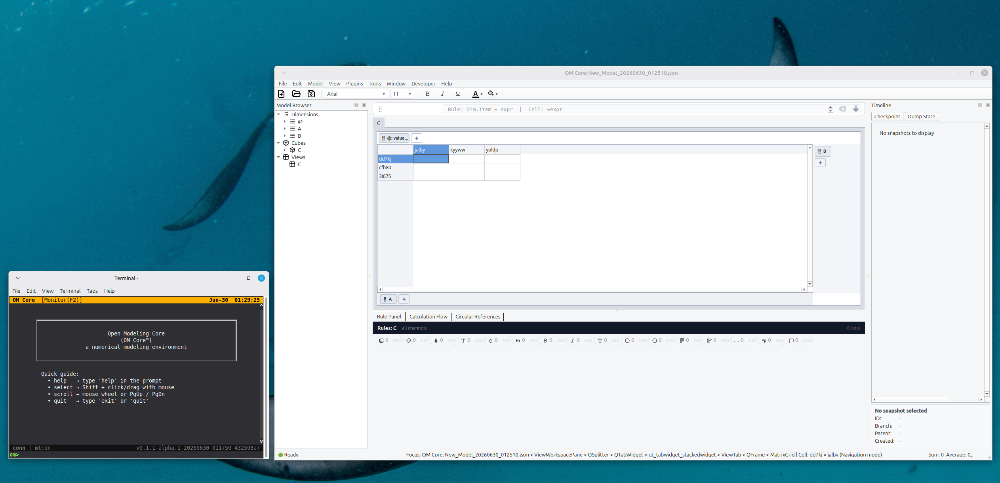
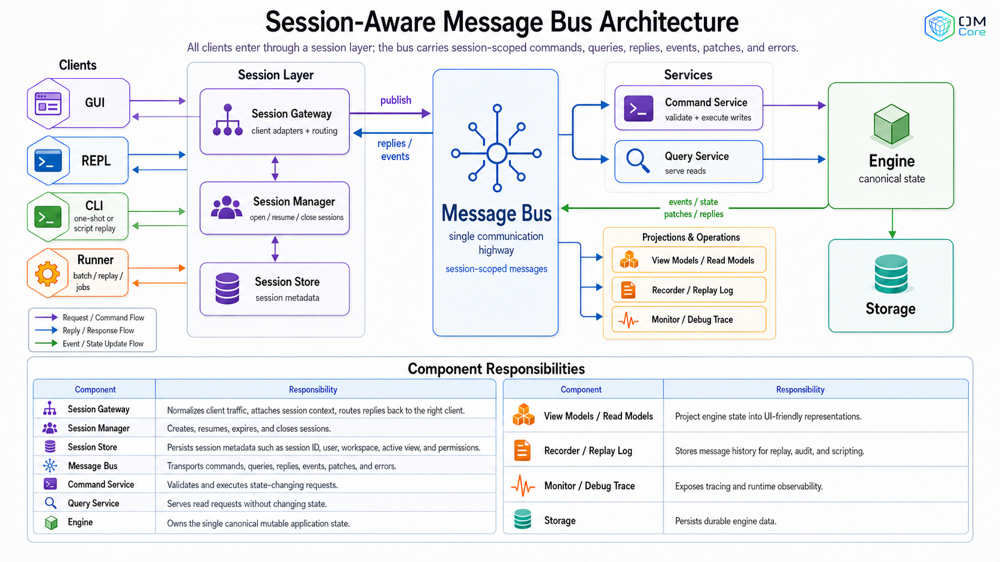

# OM Core

OM Core is an open-source reference implementation of a multidimensional
modeling engine for structured financial, operational, and analytical models.

Instead of treating the spreadsheet grid as the model, OM Core represents the
model using dimensions, cubes, groups, and rules. Grids and views are
projections of that model, not the source of truth.

> Alpha software: OM Core is under active development. APIs, command names, file
> formats, GUI behavior, and module boundaries may change before v1.0.

<p align="center">
  <a href="https://youtu.be/9txqmXQFRXc">
    
  </a>
</p>

## Documentation

The main documentation site is here:

https://cloudcell.github.io/om-docs/

Start with:

- What is OM Core: https://cloudcell.github.io/om-docs/start/what-is-om-core/
- Why not spreadsheets:
  https://cloudcell.github.io/om-docs/start/why-not-spreadsheets/
- Installation: https://cloudcell.github.io/om-docs/start/installation/
- Quickstart: https://cloudcell.github.io/om-docs/start/quickstart/

## Core idea

Most spreadsheet models mix several things together:

- model structure
- business logic
- layout
- presentation
- calculation flow
- user interaction

OM Core separates these concerns.

The model is built from:

- **Dimensions** — business axes such as Time, Account, Region, Product,
  Scenario, or Line Item.
- **Cubes** — data stored over one or more dimensions.
- **Groups and hierarchies** — structured collections and rollups.
- **Rules** — calculations expressed over semantic model addresses instead of
  spreadsheet coordinates.
- **Views** — grids and interfaces for inspecting and interacting with the
  model.

A rule should describe the business relationship, not the cell location. For
example, a model should be able to express a relationship such as gross margin
being derived from revenue and cost without making that relationship depend on a
particular row, column, or copied formula.

## Repository scope

This repository currently contains the full alpha application stack required to
run OM Core.

That includes the modeling engine and supporting command, REPL, GUI/TUI,
runtime, timeline, scripting, plugin, storage-adapter, examples, and test
layers.

Some modules are internal implementation layers. They are included because the
current alpha application depends on them. They should not yet be treated as
stable public extension APIs.

## Repository configuration

The `.om/` directory is intentionally committed.

It contains default OM Core application configuration, including toolbar
settings required by the current alpha application. It is not a temporary cache
directory or private local state.

Do not delete `.om/` unless the application configuration system has been
changed to load these defaults from another documented location.

## Installation

OM Core currently runs from source.

```bash
git clone https://github.com/cloudcell/om-core.git
cd om-core
./start.sh
```

`./start.sh` starts the GUI and asks whether to open a TUI in a separate terminal.

OM Core uses [uv](https://docs.astral.sh/uv) to manage its Python environment.
Install uv, then run `uv sync` in the project root to create `.venv` and install
dependencies. After that, `./start.sh` and the test scripts use `uv run`
automatically.

You can also start specific runtime modes:

```bash
./start.sh --gui       # graphical interface only
./start.sh --tui       # terminal interface in the current terminal
./start.sh --runtime   # headless runtime only
./start.sh --repl      # REPL command shell in the current terminal
```

For more detail, see the installation guide:

https://cloudcell.github.io/om-docs/start/installation/

## Quickstart

Running `./start.sh` launches the GUI. You will be prompted to open a TUI in a
separate terminal; accepting the default (`Y`) gives you a command shell alongside
the GUI, as shown below.

> **Note:** The first time you run `./start.sh`, `uv` will create a Python virtual
> environment in the project folder (`.venv`) and install dependencies from
> `uv.lock`.



After starting OM Core, try the built-in help command:

```text
om> help
```

You can ask for help on specific topics:

```text
om> help rule
om> help calc
```

A minimal OM Core script looks like this:

```text
# Dimensions
dim Month Jan Feb Mar

# Cube
cube Sales Month

# View
view SalesView = Sales::Month

# Rules
rule Sales::Month.Jan = 100
rule Sales::Month.Feb = Sales::Month.Jan * 1.1
rule Sales::Month.Mar = Sales::Month.Feb * 1.1

# Calculate
calc
```

Save that as `hello.openm`, then source it from the REPL or TUI:

```text
om> source hello.openm
```

For the full walkthrough, see:

https://cloudcell.github.io/om-docs/start/quickstart/

## Architecture

OM Core is split into a session-scoped runtime layer, a command/query service
layer, and multiple clients. The engine owns the canonical workspace state; the
GUI, TUI, REPL, and CLI are clients that communicate through the message bus.



## Why not just spreadsheets?

Spreadsheets are fast and flexible, but large models often become fragile
because business logic is encoded in cell addresses, copied formulas, linked
tabs, and implicit layout conventions.

OM Core uses a different level of abstraction. It makes the model explicit:
dimensions describe the axes, cubes hold values, groups organize structure,
rules define calculations, and views display the result.

The tradeoff is deliberate: you define more structure up front, and in return
the model becomes easier to audit, extend, test, and maintain as it grows.

For the longer explanation, see:

https://cloudcell.github.io/om-docs/start/why-not-spreadsheets/

## Project status

OM Core is currently alpha software.

Not yet promised before v1.0:

- stable public API
- stable plugin API
- stable scripting API
- stable file format
- packaged desktop installer
- production readiness for critical business use without independent validation

See also:

- `KNOWN_ISSUES.md`
- `CHANGELOG.md`
- `SECURITY.md`

## Legal

OM Core is distributed under the GNU Affero General Public License v3.0 unless
otherwise stated.

See:

- `LICENSE`
- `NOTICE`
- `legal/THIRD-PARTY-NOTICES.md`
- `legal/CONTRIBUTOR-CLA.md`
- `legal/CONTRIBUTOR-SIGNOFFS.md`

The `OM Core` name is governed separately from the software license.

See:

- `legal/TRADEMARKS.md`

## Contributing

Contributions are welcome, especially small, focused improvements
to examples, documentation, and clearly scoped engine behavior.

Please read:

- `CONTRIBUTING.md`
- `legal/CODE_OF_CONDUCT.md`
- `SECURITY.md`

Security issues should not be reported through public GitHub issues. See
`SECURITY.md`.

## Feedback

- **Bugs:** open a [GitHub issue](https://github.com/cloudcell/om-core/issues).
- **Discussion:** join the [Discord](https://discord.gg/GfU5ypAbaD).
